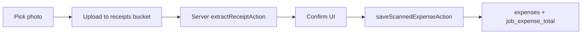

# Receipt Scanner — Implementation Report

**Date:** May 21, 2026

## Summary

PBPP admin now supports a **preview-confirm receipt flow**: upload or capture a receipt image, server-side AI extraction, editable confirmation, then save to `expenses` (optionally linked to a job). Nothing is auto-saved without explicit confirmation.

## Scanner flow

1. **Pick** — Large tap target; `capture="environment"` for camera; accepts `image/*` and `application/pdf` (PDF may fall back to manual if vision cannot parse).
2. **Upload** — Client uploads to Supabase Storage `receipts` bucket; signed URL (7-day) stored on expense.
3. **Extract** — Server action calls OpenAI `gpt-4o-mini` vision with JSON output (requires `OPENAI_API_KEY`).
4. **Confirm** — All fields editable; low confidence (&lt; 55%) shows amber warning.
5. **Save** — `saveScannedExpenseAction` → `createExpense` with optional `job_id` and `job_expense_total` sync.

## Entry points

| Location | Behavior |
|----------|----------|
| `/admin/expenses` | **Scan receipt** primary button; `?focus=scan` opens scanner; manual form secondary |
| `/admin/jobs/[id]` | **Scan receipt** in job expenses section; `job_id` prefilled |
| FAB | **Scan Receipt** → `/admin/expenses?focus=scan` |

## Extraction method

- **Primary:** OpenAI Chat Completions API (`gpt-4o-mini`) with `image_url` (signed receipt URL) and `response_format: json_object`.
- **Server-only:** `OPENAI_API_KEY` in environment (never `NEXT_PUBLIC_`).
- **Fallback:** If key missing or API fails → empty/low-confidence fields + message; user completes manual form with receipt already uploaded.

### Extracted fields

| Field | Stored |
|-------|--------|
| vendor | `expenses.vendor` |
| date | `expenses.expense_date` |
| amount | `expenses.amount` |
| category | `expenses.category` (PBPP list) |
| payment method | `expenses.payment_method` |
| description | `expenses.description` |
| tax / subtotal | Appended to `expenses.notes` |
| card last 4 | Notes only; never required |
| confidence | UI only |
| raw_text | Extraction debug (not persisted) |

### Categories (`RECEIPT_EXPENSE_CATEGORIES`)

Chemicals, Gas/Fuel, Equipment, Tools, Rentals, Dump Fees, Labor, Marketing, Software, Supplies, Repairs, Storage, Vehicle, PPE, Misc.

## Storage

- **Bucket:** `receipts` (private)
- **Paths:** `expenses/{uuid}.{ext}` or `jobs/{jobId}/{uuid}.{ext}`
- **Access:** Signed URLs via existing `uploadAdminFile` helper

## Security

- No service role key in client code
- Extraction runs in server actions only
- Full card numbers are not requested or stored; last 4 optional in notes only
- RLS unchanged on `expenses`; authenticated admin session required

## Files changed / added

| File | Role |
|------|------|
| `lib/admin/receipt-categories.ts` | Category list + normalization |
| `lib/admin/receipt-extraction.ts` | OpenAI vision extraction |
| `lib/admin/actions/receipt-scanner.ts` | `extractReceiptAction`, `saveScannedExpenseAction` |
| `lib/admin/actions/expenses.ts` | `createExpense` job sync + `listJobsForExpenseLink` |
| `components/admin/receipt-scanner-flow.tsx` | Mobile confirm UI |
| `components/admin/expense-manager.tsx` | Scanner + manual entry |
| `components/admin/job-detail-view.tsx` | Job scan entry |
| `app/admin/expenses/page.tsx` | Pass jobs list |
| `lib/admin/constants.ts` | Categories alias; FAB scan link |
| `lib/admin/actions/jobs.ts` | `addJobExpense` delegates to `createExpense` |
| `.env.example` | `OPENAI_API_KEY` documented |

## Limitations

- Requires **OPENAI_API_KEY** for automatic extraction; without it, manual entry only (receipt still uploads).
- PDF support depends on OpenAI vision; unreliable PDFs should use manual entry.
- Signed receipt URLs expire (~7 days); re-link or re-upload for long-term archival if needed.
- No multi-receipt batch import in this pass.
- Extraction quality varies with photo blur, crumpling, and lighting.

## Test results (automated)

| Command | Result |
|---------|--------|
| `npm run verify:public-homepage` | PASS |
| `npm run type-check` | PASS |
| `npm run build` | PASS |
| `npm run lint` | PASS |

## Public homepage

- **`app/(site)/**` not modified**
- **`components/marketing/**` not modified**
- Homepage lock verify script passed

## Manual iPhone checklist

- [ ] Set `OPENAI_API_KEY` in Vercel/local `.env.local`
- [ ] Scan receipt from `/admin/expenses`
- [ ] Scan from job detail; confirm job link
- [ ] Edit fields before save
- [ ] Save; verify list + job profit update
- [ ] Test without API key → manual fallback message
- [ ] Rescan / Cancel buttons
